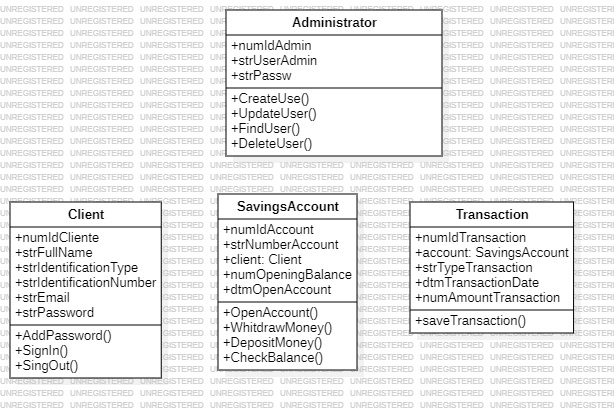

# Savings Account Management System

This is a savings account management system developed as a technical test. The solution consists of a backend developed in Django and a frontend in Angular.

## System Requirements
- Python 3.12.3
- Django 5.0.6
- Angular CLI 17.3.3
- Node.js 20.12.1
- npm 10.5.1
- Database Engine (Oracle recommended)

## Environment Setup

### Backend (Django)
1. **Clone this repository** to your local machine.
2. **Navigate to the** `backend` **directory from the command line.**
3. **Create a virtual environment** (optional but recommended): `python -m venv venv`.
4. **Activate the virtual environment:**
   - On Windows: `venv\Scripts\activate`.
   - On macOS/Linux: `source venv/bin/activate`.
5. **Install project dependencies:** `pip install -r requirements.txt`.
6. **Configure access to the Oracle database.**
7. **Run database migrations:** `python manage.py migrate`.
8. **Start the development server:** `python manage.py runserver`.

### Frontend (Angular)
1. **Navigate to the** `frontend` **directory from the command line.**
2. **Install project dependencies:** `npm install`.
3. **Start the development server:** `ng serve`.
4. **Access the frontend** at [http://localhost:4200](http://localhost:4200) **in your browser.**

## Usage

This savings account management system is designed to be used as a competitive platform in the financial market. It offers the following features:

- **Management of client accounts.**
- **Registration and authentication of administrators.**
- **Interface for a client created by the administrator to set their password.**
- **Administration panel for user creation and querying.**
- **User panel for managing accounts, which includes the following functions:**
  - *Check balance.*
  - *Deposit.*
  - *Withdrawal with static OTP generation.*

## Oracle Database Configuration
- Download https://visualstudio.microsoft.com/es/visual-cpp-build-tools/ v.14 +
- Use pip install cx_Oracle
- Configure settings.py with the DB info
- DATABASES = {
    "default": {
        "ENGINE": "django.db.backends.oracle",
        "NAME": "SID",
        "USER": "username",
        "PASSWORD": "password",
        "HOST": "host",
        "PORT": "0000",
    }
}

Use the provided [DDL file](DDL_DJANGO_PROOF.SQL) to create the necessary tables in the Oracle database. It is recommended to install the Oracle component for Django for better integration with the database.

## Consideration to manage de app for first time
### New Routes Added:

- **Admin Login Route: http://localhost:4200/admin-login**
  - Exclusive access route for administrators. Allows direct login from the URL without the need to navigate through the homepage.

- **Manage Admin Route: http://localhost:4200/manageAdmin**
  - After logging in as an administrator, this route directs to the interface where new clients can be created or the list of existing clients can be viewed.

- **Create Client Route: http://localhost:4200/createClient**
  - Interface intended for creating a new client. Here, the necessary data is collected to register a new user in the system.

- **Get Client Route: http://localhost:4200/manageAdmin/getClient/:document**
  - Provides an interface to view specific details of a client, identified by their document number.

- **Home Route: http://localhost:4200**
  - Default interface for the login page. This is where users, whether administrators or clients, can log into the system.

- **Create Password Route: http://localhost:4200/create-password**
  - After creating a new client, this interface allows the client to set a password for their account.

- **Client Login Route: http://localhost:4200/client-login**
  - Login interface for clients. Once a client has set their password, they can use this route to log into their account.

- **Home Route: http://localhost:4200/home**
  - After logging in as a client, this interface provides access to various functions such as creating a savings account or managing existing accounts.

- **Create Account Route: http://localhost:4200/client-login/home/createAccount**
  - Interface where clients can create new savings accounts.

- **Manage Account Route: http://localhost:4200/client-login/home/manageAccount**
  - This interface allows clients to check balance, withdraw, or deposit funds into their existing savings accounts.

## Contribution

If you wish to contribute to this project, please follow these steps:

1. **Fork the repository.**
2. **Create a branch with a descriptive name:** `git checkout -b my-new-feature`.
3. **Make your changes and commit:** `git commit -am 'Add a new feature'`.
4. **Push your changes to your repository:** `git push origin my-new-feature`.
5. **Create a new Pull Request.**

## Credits

This project was developed by Luis Felipe Supelano Mesa - Supported by the documentation of Django/Angular/Oracle.

## License

This project is licensed under the MIT License - see the [LICENSE](LICENSE) file for more details.
